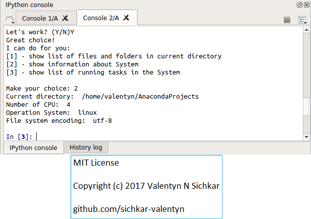

# Variables and Branching in Python
Variables and Branching in Python

### Reference to:
[1] Valentyn N Sichkar. Variables and Branching in Python // GitHub platform [Electronic resource]. URL: https://github.com/sichkar-valentyn/Variables_and_Branching_in_Python (date of access: XX.XX.XXXX)

## Description
Using Spyder as IDE for Python here is the program which shows how to create menue for the user.
In program the modules _os_, _psutil_ and _sys_ are imported to show the results.

## Variables and Branching in Python

## MIT License
## Copyright (c) 2017 Valentyn N Sichkar
## github.com/sichkar-valentyn
### Reference to:
[1] Valentyn N Sichkar. Variables and Branching in Python // GitHub platform [Electronic resource]. URL: https://github.com/sichkar-valentyn/Variables_and_Branching_in_Python (date of access: XX.XX.XXXX)
